# Homework 2: Mage for Data Engineering Zoomcamp 2024

In this homework, we'll create a data workflow with Mage. More information can be found [here](https://github.com/DataTalksClub/data-engineering-zoomcamp/blob/main/cohorts/2024/02-workflow-orchestration/homework.md). If none of the options match, select the closest one.

#### Due date: Feb. 8, 2024, 11 p.m.

# ATTENTION
At the end of the submission form, you will be required to include a link to your GitHub repository or other public code-hosting site. This repository should contain your code for solving the homework. If your solution includes code that is not in file format, please include these directly in the README file of your repository.

**Note**: In case you don't get one option exactly, select the closest one.

For the homework, we'll be working with the green taxi dataset located [here](https://github.com/DataTalksClub/nyc-tlc-data/releases/tag/green/download).

You may need to reference the link below to download via Python in Mage:

[Download Link](https://github.com/DataTalksClub/nyc-tlc-data/releases/download/green/)

## Assignment
The goal will be to construct an ETL pipeline that loads the data, performs some transformations, and writes the data to a database (and Google Cloud!).

1. Create a new pipeline, call it `green_taxi_etl`.
2. Add a data loader block and use Pandas to read data for the final quarter of 2020 (months 10, 11, 12). You can use the same datatypes and date parsing methods shown in the course. **BONUS**: load the final three months using a for loop and `pd.concat`.
3. Add a transformer block and perform the following:
   - Remove rows where the passenger count is equal to 0 and the trip distance is equal to zero.
   - Create a new column `lpep_pickup_date` by converting `lpep_pickup_datetime` to a date.
   - Rename columns in Camel Case to Snake Case, e.g. `VendorID` to `vendor_id`.
4. Add three assertions:
   - `vendor_id` is one of the existing values in the column (currently)
   - `passenger_count` is greater than 0
   - `trip_distance` is greater than 0
5. Using a Postgres data exporter (SQL or Python), write the dataset to a table called `green_taxi` in a schema `mage`. Replace the table if it already exists.
6. Write your data as Parquet files to a bucket in GCP, partitioned by `lpep_pickup_date`. Use the `pyarrow` library!
7. Schedule your pipeline to run daily at 5AM UTC.

# Questions

## Question 1. Data Loading
Once the dataset is loaded, what's the shape of the data?
- 266,855 rows x 20 columns (this is the answer)
- 544,898 rows x 18 columns
- 544,898 rows x 20 columns
- 133,744 rows x 20 columns

```python
import io
import pandas as pd
import requests
if 'data_loader' not in globals():
    from mage_ai.data_preparation.decorators import data_loader
if 'test' not in globals():
    from mage_ai.data_preparation.decorators import test

@data_loader
def load_data_from_api(*args, **kwargs):
    """
    Template for loading data from API
    """
    # url = 'https://github.com/DataTalksClub/nyc-tlc-data/releases/tag/green/download'
    base_url = 'https://github.com/DataTalksClub/nyc-tlc-data/releases/download/green/green_tripdata_2020-{}.csv.gz'

    taxi_dtypes = {
        'vendorID' : pd.Int64Dtype(),
        'passenger_count' : pd.Int64Dtype(),
        'trip_distance' : float,
        'RatecodeID' : pd.Int64Dtype(),
        'store_and_fwd_flag': str,
        'PULocationID' : pd.Int64Dtype(),
        'DOLocationID' : pd.Int64Dtype(),
        'payment_type' : pd.Int64Dtype(),
        'fare_amount' : float,
        'extra': float,
        'mta_tax' : float,
        'tip_amount ': float,
        'tolls_amount' : float,
        'improvement_surcharge' : float,
        'total_amount': float,
        'congestion_surcharge': float
    }

    parse_dates = ['lpep_pickup_datetime', 'lpep_dropoff_datetime']
    
    # Initialize an empty list to store dataframes
    dfs = []

    # Loop through the final quarter months
    for month in ['10', '11', '12']:
   
        # Construct the file URL for each month
        file_url = base_url.format(month)
        # Read the CSV file from the constructed URL
        df = pd.read_csv(file_url, sep=',', compression='gzip', dtype=taxi_dtypes, parse_dates=parse_dates)
        # Append the dataframe to the list
        dfs.append(df)

    # Concatenate all dataframes in the list
    final_df = pd.concat(dfs, ignore_index=True)

    return final_df
        
@test
def test_output(output, *args) -> None:
    """
    Template code for testing the output of the block.
    """
    assert output is not None, 'The output is undefined'
```

## Question 2. Data Transformation
Upon filtering the dataset where the passenger count is greater than 0 and the trip distance is greater than zero, how many rows are left?
- 544,897 rows
- 266,855 rows
- 139,370 rows (this is the answer)
- 266,856 rows

```python
@transformer
def transform(data, *args, **kwargs):
    # Print the number of rows with zero passengers
    print("Rows with zero passengers:", data['passenger_count'].isin([0]).sum())

    # Print the number of rows with zero trip distance
    print("Rows with zero trip distance:", data['trip_distance'].isin([0]).sum())
```

## Question 3. Data Transformation
Which of the following creates a new column `lpep_pickup_date` by converting `lpep_pickup_datetime` to a date?
- `data = data['lpep_pickup_datetime'].date`
- `data('lpep_pickup_date') = data['lpep_pickup_datetime'].date`
- `data['lpep_pickup_date'] = data['lpep_pickup_datetime'].dt.date` (this is the answer)
- `data['lpep_pickup_date'] = data['lpep_pickup_datetime'].dt().date()`

```python

```

## Question 4. Data Transformation
What are the existing values of `VendorID` in the dataset?
- 1, 2, or 3
- 1 or 2 (this is the answer)
- 1, 2, 3, 4
- 1

```python
@test
def test_output(output, *args):
    
    # First, capture and print the unique vendor_ids for informational purposes
    unique_vendor_ids = output['vendor_id'].unique()
    print(f"Unique vendor_id values in the output: {unique_vendor_ids}")
    
    # Use an assertion to ensure this statement is always true; this is a bit unconventional
    # since assertions are typically used for actual tests, not information display.
    # This assertion will always pass unless there's an unexpected modification to the 'vendor_id' values.
    assert set(unique_vendor_ids).issubset(set([1, 2, 3, 4])), "Detected unexpected vendor_id values."
```

## Question 5. Data Transformation
How many columns need to be renamed to snake case?
- 3
- 6
- 2
- 4 (this is the answer)

```python
import pandas as pd
    import re
    
    if 'transformer' not in globals():
        from mage_ai.data_preparation.decorators import transformer
    if 'test' not in globals():
        from mage_ai.data_preparation.decorators import test
    
    
    @transformer
    def transform(data, *args, **kwargs):
        
        # Check is all columns are snake case
        def is_snake_case(name):
            return re.match(r'^[a-z_][a-z0-9_]*$', name) is not None
    
        # convert all camel columns names to snake
        def camel_to_snake(name):
            return re.sub(r'(?<=[a-z0-9])([A-Z])|(?<=[A-Z])([A-Z])(?=[a-z])', r'_\g<0>', name).lower()
        
        # Remove rows where the passenger count is 0 or the trip distance is 0.
        condition = (data['passenger_count'] > 0) & (data['trip_distance'] > 0)
        data = data[condition]
        
        # Create a new column 'lpep_pickup_date' by converting 'lpep_pickup_datetime' to a date.
        data['lpep_pickup_date'] = pd.to_datetime(data['lpep_pickup_datetime']).dt.date.copy()
        
        # Rename columns in Camel Case to Snake Case
        data.columns = [camel_to_snake(column) for column in data.columns]
        
        # Add three assertion to check the transformations      
        assert all(is_snake_case(column) for column in data.columns), "Not all column names are in snake case."
        assert (data['passenger_count'] > 0).all(), "'passenger_count' contains non-positive values."
        assert (data['trip_distance'] > 0).all(), "'trip_distance' contains non-positive values."
        
        return data 
    
    
    @test
    def test_output(output, *args) -> None:
        """
        Template code for testing the output of the block.
        """
        assert output is not None, 'The output is undefined'
```

## Question 6. Data Exporting
Once exported, how many partitions (folders) are present in Google Cloud?
- 96 (this is the answer)
- 56
- 67
- 108

```python
from mage_ai.settings.repo import get_repo_path
from mage_ai.io.config import ConfigFileLoader
from mage_ai.io.google_cloud_storage import GoogleCloudStorage
from pandas import DataFrame
from os import path
import pyarrow as pa
import pyarrow.parquet as pq
import os

if 'data_exporter' not in globals():
    from mage_ai.data_preparation.decorators import data_exporter

os.environ['GOOGLE_APPLICATION_CREDENTAILS'] = '/home/src/my-creds.json'

bucket_name = 'demo-terra-bucket'
project_id = 'sublime-iridium-411308'

table_name = "nyc_green_taxi"

root_path = f'{bucket_name}/{table_name}'

@data_exporter
def export_data(data, *args, **kwargs):
    
    table = pa.Table.from_pandas(data)

    gcs = pa.fs.GcsFileSystem()

    pq.write_to_dataset(
        table,
        root_path=root_path,
        partition_cols=['lpep_pickup_date'],
        filesystem=gcs
    )
```

### Homework URL  
https://github.com/imansubarkahwork/dezoomcamp2024/blob/master/homework/homework_week2.md

### Learning in public links (optional)  

### Time spent on lectures (hours) (optional)  

### Time spent on homework (hours) (optional)  

### Problems or comments (optional)  

### FAQ contribution (FAQ document, optional)  

# Preparation
## 1. Configure Mage:

Start by cloning the repo:
```bash
git clone https://github.com/mage-ai/mage-zoomcamp.git mage-zoomcamp
```

Enter into directory 'mage-zoomcamp'
```bash
cd mage-zoomcamp
```

Copy dev.env into .env
```bash
cp dev.env .env
```

Now, let's build the container
```bash
docker compose build
```

To update to latest mage version, run this command
```bash
docker pull mageai/mageai:latest
```

Finally, start the Docker container in detached mode:
```bash
docker compose up -d
```

Now, navigate to http://localhost:6789 in your browser! Voila! You're ready to get started with the course.

In web browser http://localhost:6789, navigate to menu: magic-zoomcamp > Files
Klik and modify io_config.yaml file with added this line in the bottom:
```yaml
  dev:
    POSTGRES_CONNECT_TIMEOUT: 10
    POSTGRES_DBNAME: "{{ env_var('POSTGRES_DBNAME') }}"
    POSTGRES_SCHEMA: "{{ env_var('POSTGRES_SCHEMA') }}"
    POSTGRES_USER: "{{ env_var('POSTGRES_USER') }}"
    POSTGRES_PASSWORD: "{{ env_var('POSTGRES_PASSWORD') }}"
    POSTGRES_HOST: "{{ env_var('POSTGRES_HOST') }}"
    POSTGRES_PORT: "{{ env_var('POSTGRES_PORT') }}"
```

Save change with [CTRL + S]

## 2. A Simple Pipeline
### 1. Create new pipeline
Navigate to menu: magic-zoomcamp > Pipelines  
Click New > Standard (batch)  
Click Edit > Pipeline settings

In the Details > Pipeline name  
Change the Pipeline name with "test_config"

Click "Save pipeline settings" button to save change pipeline name

### 2. Add Data loader
Go to:  
magic-zoomcamp > Pipelines > test_config > Edit  
Click "+ Data loader > SQL

Fill Data loader Name with "test_postgres"  
Click "Save and add" button

In "Connection" select "PostgeSQL"  
In "Profile" select "dev" (here is env that we set before in io_config.yaml file)

Type (to know we able to connect with PostgreSQL):
```sql
SELECT 1;
```
and then click "Run block" button  

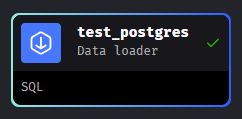

## 3. ETL: API to Postgres
### 1. Create new pipeline
Navigate to menu: magic-zoomcamp > Pipelines  
Click New > Standard (batch)  
Click Edit > Pipeline settings

In the Details > Pipeline name  
Change the Pipeline name with "api_to_postgres"

Click "Save pipeline settings" button to save change pipeline name

### 2. Add Data loader
Go to:  
magic-zoomcamp > Pipelines > test_config > Edit  
Click "+ Data loader > Python > API

Fill Data loader Name with "load_api_data"  
Click "Save and add" button

1. Fill url='' in @data_loader
2. Declare data type
```bash
@data_loader
def load_data_from_api(*args, **kwargs):
    """
    Template for loading data from API
    """
    url = 'https://github.com/DataTalksClub/nyc-tlc-data/releases/download/yellow/yellow_tripdata_2021-01.csv.gz'

    taxi_dtypes = {
            'VendorID': pd.Int64Dtype(),
            'passenger_count': pd.Int64Dtype(),
            'trip_distance': float,
            'RatecodeID': pd.Int64Dtype(),
            'store_and_fwd_flag': str,
            'PULocationID': pd.Int64Dtype(),
            'DOLocationID': pd.Int64Dtype(),
            'payment_type': pd.Int64Dtype(),
            'fare_amount': float,
            'extra': float,
            'mta_tax': float,
            'tip_amount': float,
            'tolls_amount': float,
            'improvement_surcharge': float,
            'total_amount': float,
            'congestion_surcharge': float 
        }
    
    parse_dates = ['tpep_pickup_datetime', 'tpep_dropoff_datetime']

    return pd.read_csv(url, sep=",", compression="gzip", dtype=taxi_dtypes, parse_dates=parse_dates)
```
and then click "Run block" button  

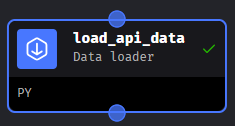

See the data, especially in column: tpep_pickup_datetime and tpep_dropoff_datetime, they look's already formatted properly:  

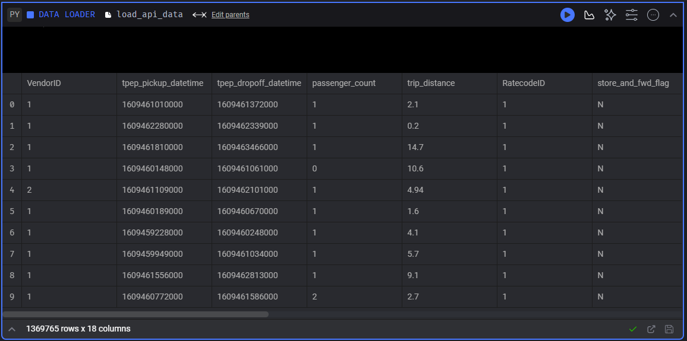

### 3. Add Transformer
Next, we do some transformation, so click on Transformer > Python > Generic (no template)

Fill Transformer Name with "transform_taxi_data"  
Click "Save and add" button  

Edit transform_taxi_data transformer with this line:  
```python
@transformer
def transform(data, *args, **kwargs):
    print("Rows with zero passengers:", data['passenger_count'].isin([0]).sum())

    return data[data['passenger_count'] > 0]
```

and then click "Run block" button  
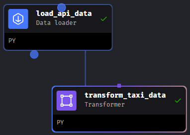  

and the result is like see in the image below:  
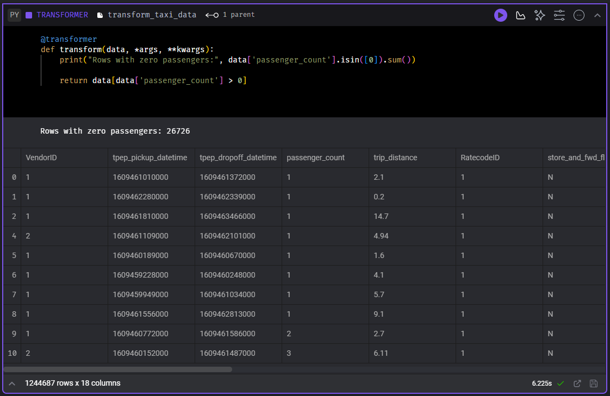  

Then we will add @test in the bottom:  
```python
@test
def test_output(output, *args):
    assert output['passenger_count'].isin([0]).sum() == 0, 'There are rides with zero passengers'
```  

and then click "Run block" button  
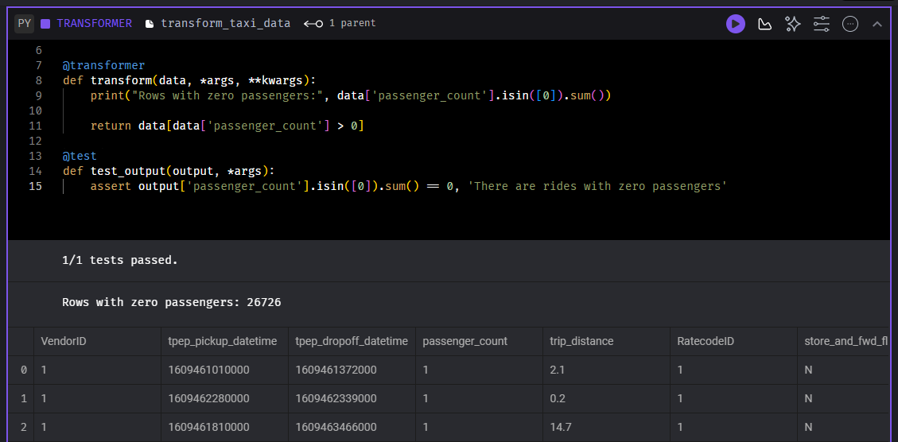  

### 4. Add Data exporter
Next, we do some data exporter, so click on Data exporter > Python > PostgreSQL  

Fill Data exporter Name with "taxi_data_to_postgres"  
Click "Save and add" button  

Modify Data exporter "taxi_data_to_postgres"  
```python
    schema_name = 'ny_taxi'  # Specify the name of the schema to export data to
    table_name = 'yellow_cab_data'  # Specify the name of the table to export data to
    config_path = path.join(get_repo_path(), 'io_config.yaml')
    config_profile = 'dev'
```  

and then click "Run block" button  

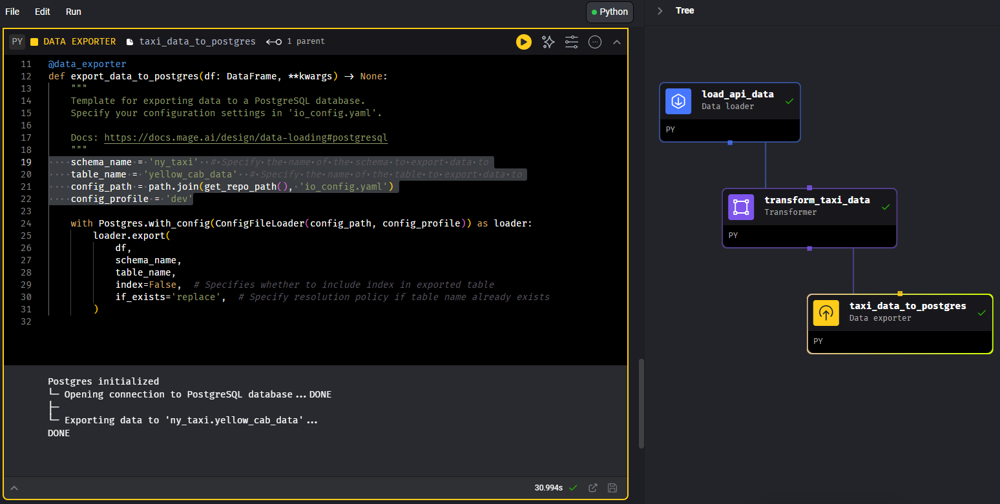  

### 5. Add Data loader
Now, check if the data exists in database table:  
Click on Data loader > SQL  

Fill Data loader Name with "load_taxi_data"  
Click "Save and add" button  

In "Connection" select "PostgeSQL"  
In "Profile" select "dev" (here is env that we set before in io_config.yaml file)

Type (to check we are successful to load data into postreSQL database table):
```sql
SELECT * FROM ny_taxi.yellow_cab_data LIMIT 10
```
and then click "Run block" button  

Here's the result:  

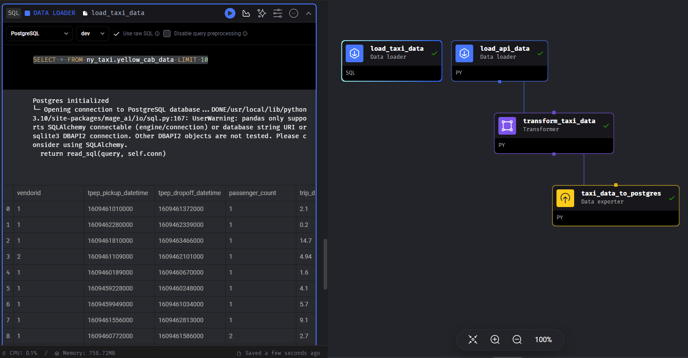  

## 4. Configuring GCP
### 1. Create new google cloud storage
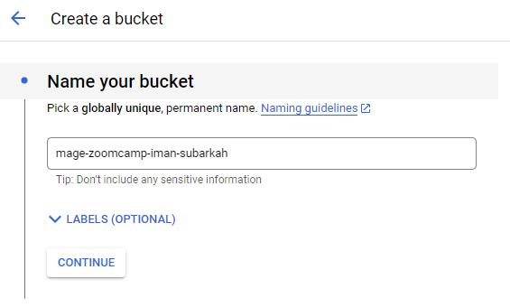  

Then, click CONTINUE button:  
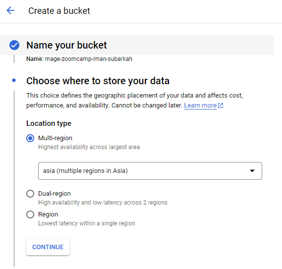  

Then, click CONTINUE button:  
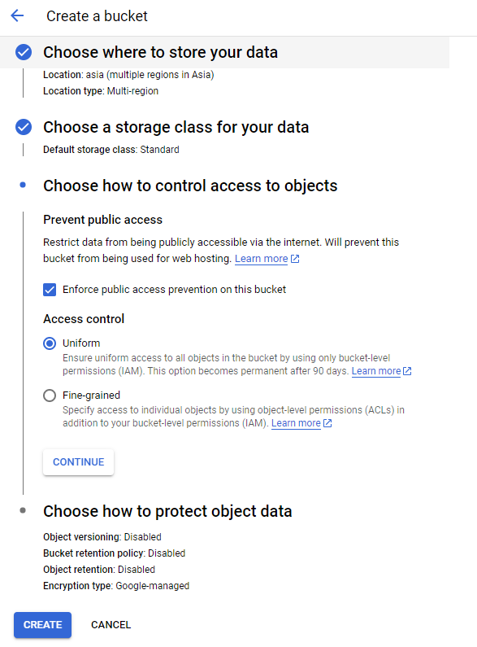  

Then, click CREATE button  

### 2. Create new service account
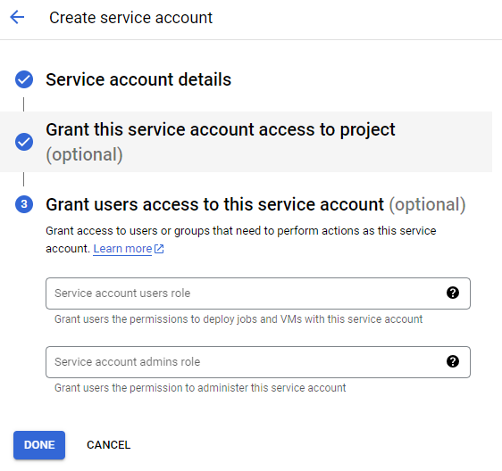  

### 3. Create new service account key
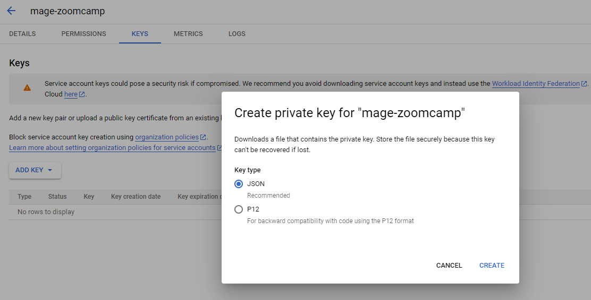  

### 4. Copy json key into root project directory
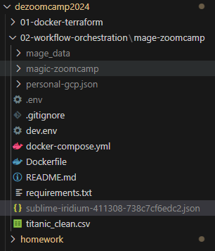  

Check from mage interface, go to http://localhost:6789
Click Terminal and type  
```bash
ls -la
```  
So, we can see out google service account json key placed in there:  
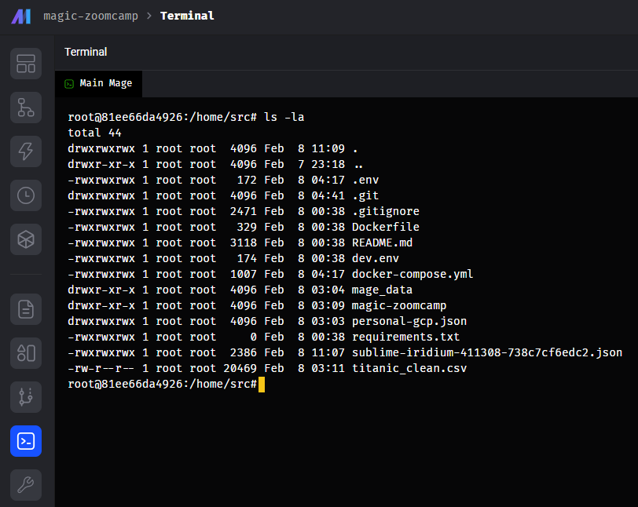  

navigate to menu: magic-zoomcamp > Files
Klik and modify io_config.yaml file with modify this line:
```yaml
  # Google
  GOOGLE_SERVICE_ACC_KEY_FILEPATH: "/home/src/my-creds.json"
  GOOGLE_LOCATION: US # Optional
```  

Save change with [CTRL + S]  

### 5. Check google cloud storage connection from mage
Navigate to menu: magic-zoomcamp > Pipelines  
Click on "test_config" > Edit pipeline  
