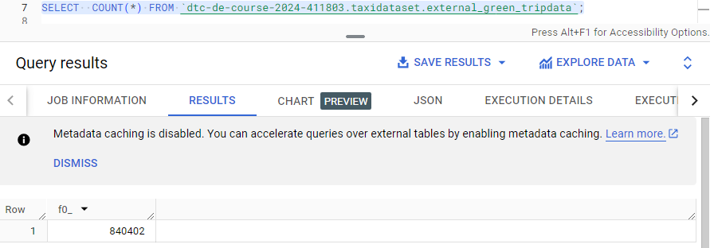
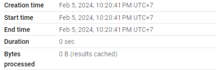
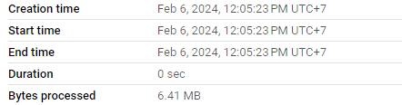
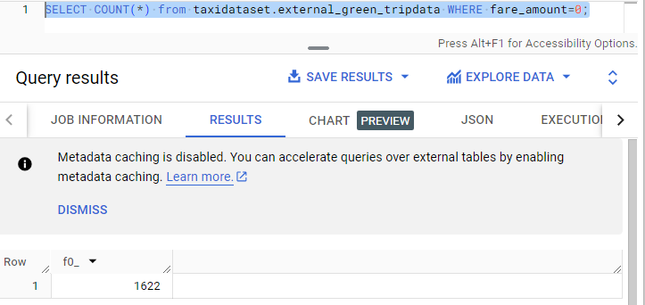
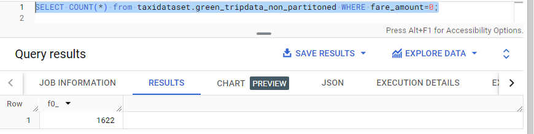
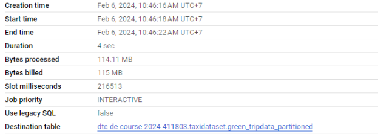
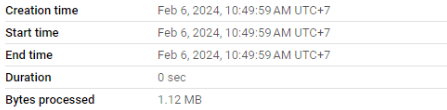

# Homework 3: Data Warehouse

**ATTENTION:** At the end of the submission form, you will be required to include a link to your GitHub repository or other public code-hosting site. This repository should contain your code for solving the homework. If your solution includes code that is not in file format (such as SQL queries or shell commands), please include these directly in the README file of your repository.

## Important Note

For this homework, we will be using the 2022 Green Taxi Trip Record Parquet Files from the New York City Taxi Data found [here](https://www.nyc.gov/site/tlc/about/tlc-trip-record-data.page). If you are using orchestration such as Mage, Airflow, or Prefect, do not load the data into Big Query using the orchestrator. Stop with loading the files into a bucket.

**NOTE:** You will need to use the PARQUET option files when creating an External Table.

## SETUP

Create an external table using the Green Taxi Trip Records Data for 2022.
Create a table in BQ using the Green Taxi Trip Records for 2022 (do not partition or cluster this table).

# Create Green Tripdata External Table
```sql
-- Create Green Tripdata External Table
CREATE OR REPLACE EXTERNAL TABLE `taxidataset.external_green_tripdata`
OPTIONS (
  format = 'PARQUET',
  uris = ['gs://de-zoomcamp-garjita-bucket/green_tripdata_2022/green_tripdata_2022-*.parquet']	
);
```

# Create a non partitioned table from external table
```sql
-- Create a non partitioned table from external table
CREATE OR REPLACE TABLE taxidataset.green_tripdata_non_partitioned AS
SELECT * FROM taxidataset.external_green_tripdata;
```

## Question 1

What is the count of records for the 2022 Green Taxi Data?

- 65,623,481
- **840,402 (this is my answer)**
- 1,936,423
- 253,647

## Answer 1

```sql
SELECT  COUNT(*) FROM `dtc-de-course-2024-411803.taxidataset.external_green_tripdata`;
```  
  

_Answer --> 840,402_

## Question 2

Write a query to count the distinct number of PULocationIDs for the entire dataset on both the tables. What is the estimated amount of data that will be read when this query is executed on the External Table and the Table?

- **0 MB for the External Table and 6.41 MB for the Materialized Table (this is my answer)**
- 18.82 MB for the External Table and 47.60 MB for the Materialized Table
- 0 MB for the External Table and 0 MB for the Materialized Table
- 2.14 MB for the External Table and 0 MB for the Materialized Table  

## Answer 2

_Select from External Table in BigQuery_  

```sql
SELECT DISTINCT(PULocationID) FROM taxidataset.external_green_tripdata;
```  
  

**_Select from non-partitioned table in BigQuery_**  

```sql
SELECT DISTINCT(PULocationID) FROM taxidataset.green_tripdata_non_partitioned;
```  

  

_Answer --> 0 MB for the External Table and 6.41MB for the Materialized Table_

## Question 3

How many records have a fare_amount of 0?

- 12,488
- 128,219
- 112
- **1,622 (this is my answer)**  

## Answer 3

_Select from external table_  

```sql
SELECT COUNT(*) from taxidataset.external_green_tripdata WHERE fare_amount=0;
```  

  

_Select from non-prtitioned table_  

  

_Answer --> 1,622_

## Question 4

What is the best strategy to make an optimized table in Big Query if your query will always order the results by PUlocationID and filter based on lpep_pickup_datetime? (Create a new table with this strategy)

- Cluster on lpep_pickup_datetime Partition by PUlocationID
- **Partition by lpep_pickup_datetime Cluster on PUlocationID (this is my answer)**
- Partition by lpep_pickup_datetime and Partition by PUlocationID
- Cluster on by lpep_pickup_datetime and Cluster on PUlocationID  

## Answer 4

_Best partcice for query performance:_  
```sql
i) Filter on partitioned columns
ii) the order of the columns in which the clustering is specified is important in order to determine the column priority
```  

_Answer --> Partition by lpep_pickup_datetime  Cluster on PUlocationID_

## Question 5

Write a query to retrieve the distinct PULocationID between lpep_pickup_datetime 06/01/2022 and 06/30/2022 (inclusive).

Use the materialized table you created earlier in your from clause and note the estimated bytes. Now change the table in the from clause to the partitioned table you created for question 4 and note the estimated bytes processed. What are these values?

Choose the answer which most closely matches.

- 22.82 MB for non-partitioned table and 647.87 MB for the partitioned table
- **12.82 MB for non-partitioned table and 1.12 MB for the partitioned table (this is my answer)**
- 5.63 MB for non-partitioned table and 0 MB for the partitioned table
- 10.31 MB for non-partitioned table and 10.31 MB for the partitioned table  

## Answer 5

_Create partitined table_

```sql
CREATE OR REPLACE TABLE taxidataset.green_tripdata_partitioned
PARTITION BY DATE(lpep_pickup_datetime)
CLUSTER BY PUlocationID AS
SELECT * FROM taxidataset.external_green_tripdata;
```  

  

**Retrieve the distinct PULocationID between lpep_pickup_datetime 06/01/2022 and 06/30/2022 (inclusive)**  

_Select from non-partitioned table_  

```sql
SELECT DISTINCT(PULocationID) 
FROM taxidataset.green_tripdata_non_partitioned
WHERE DATE(lpep_pickup_datetime) BETWEEN '2022-06-01' and '2022-06-30';
```  

  

_Select from partitioned table_  

```sql
SELECT DISTINCT(PULocationID)
FROM taxidataset.green_tripdata_partitioned
WHERE DATE(lpep_pickup_datetime) BETWEEN '2022-06-01' and '2022-06-30';
```  

  

_Answer --> 12.82 MB for non-partitioned table and 1.12 MB for the partitioned table_

## Question 6

Where is the data stored in the External Table you created?

- Big Query
- **GCP Bucket (this is my answer)**
- Big Table
- Container Registry  

# Answer 6

An external table is a table that acts like a standard BQ table. The table metadata (such as the schema) is stored in BQ storage but the data itself is external (GCP Bucket).

_Answer --> GCP Bucket_

## Question 7

It is best practice in Big Query to always cluster your data:

- **True (this is my answer)**
- False  

## Answer 7

- Clustered tables can improve query performance and reduce query costs.  
- If your queries commonly filter on particular columns, clustering accelerates queries because the query only scans the blocks that match the filter.  
- If your queries filter on columns that have many distinct values (high cardinality), clustering accelerates these queries by providing BigQuery with detailed metadata for where to get input data.  
- Clustering enables your table's underlying storage blocks to be adaptively sized based on the size of the table.

_Answer -->True_

## (Bonus: Not worth points) Question 8

No Points: Write a SELECT count(*) query FROM the materialized table you created. How many bytes does it estimate will be read? Why?

## Answer 8

_Select from non partitioned table_  
```sql
SELECT COUNT(*) FROM taxidataset.green_tripdata_non_partitioned;
```  

  

_Select from partitioned table_  
```sql
SELECT COUNT(*) FROM taxidataset.green_tripdata_partitioned;
```  

  

_Answer --> 0 bytes_  

_**Because: query SELECT COUNT(*) is getting answered from metadata tables, hence no cost.**_